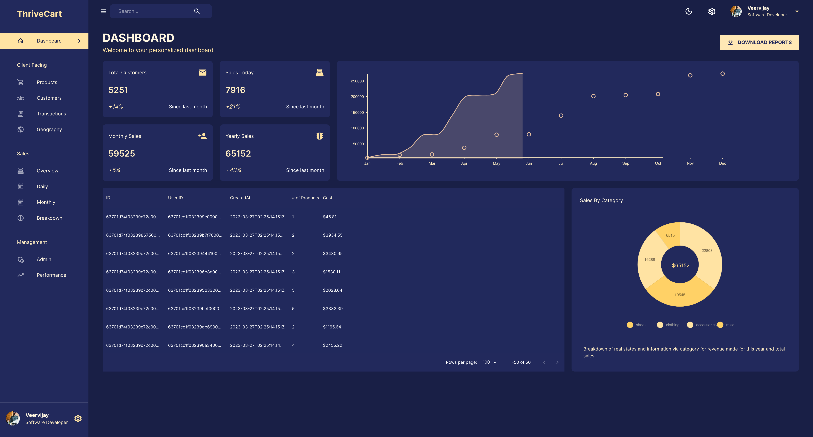

<h2 align="center">
  MERN Stack Admin Dashboard 
  <a href="" target="_blank">ThriveCart</a>
</h2>

  

 

 &nbsp;
 &nbsp;
 &nbsp;

## Built With

This project was built using these technologies.

- `React.js`
- `Node.js`
- `Express.js`
- `CSS`
- `Material-UI`
- `MongoDB`
- `Redux Toolkit`

## Features

**📖 `Multi-page Layout Featuring Sidebar Navigation`**

**💡 `Switching between Dark and Light Modes`**

**📱 `Ensuring responsiveness across various devices and screen sizes`**

**🖥️ `Establishing a Proprietary Database and Backend Server Configuration`**
